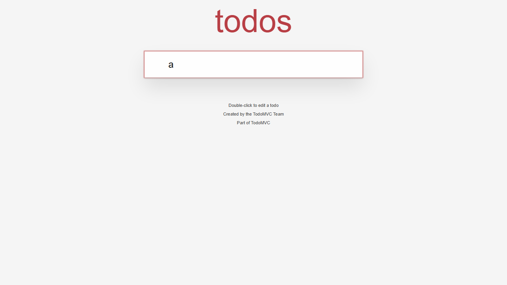
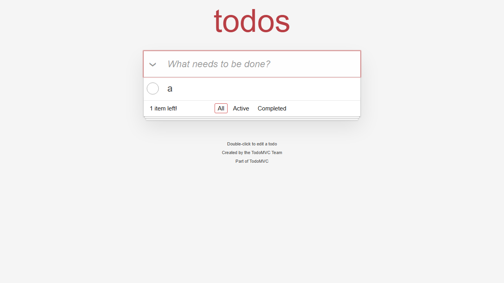

# E2P UI Defect-Discovery Trial Report

Date: August 23-24, 2026

## Executive conclusion

The current implementation can produce a reproducible UI defect hypothesis and turn the model journey into an executable failing Playwright test. This was demonstrated on a public historical TodoMVC revision and controlled with the same test on the current revision.

The broader blind trial does **not** yet demonstrate reliable defect precision. Three current third-party applications completed the protocol, but none yielded a human-confirmed defect. The model retained several hypotheses that were contradicted by normal UI behavior. Model confidence must therefore be reported as a self-assessment, not as probability that a defect is real.

## Comparable current-application trials

All three applications are public, third-party projects. They were explored with local `qwen2.5vl:7b`, guest access, the same action protocol, screenshots, structured UI states, flow planning, Playwright generation, and execution.

| Application | Revision | Actions / states | Model candidates | Retained hypotheses | Generated execution | Human-confirmed defects |
| --- | --- | ---: | ---: | ---: | ---: | ---: |
| Fake Store | `8e205db216ad16b370761e65274fad151b73f85e` | 20 / 11 | 8 | 8 | 1/1 passed | 0 |
| TodoMVC React, current | `ff43b02e59dfa604386bb382034b2cd07c2bcd8a` | 5 / 3 | 3 | 3 | 1/1 passed | 0 |
| Movie Seat Booking | `adc66a181a67049fb413c8862181ddc6c45ba22b` | 20 / 20 | 5 | 4 | 1/1 passed | 0 |

These runs prove that three applications passed through the implemented trial. They do not prove that every retained hypothesis is a defect. Examples of false positives included treating an empty Favorites page as broken, expecting a search field to clear without a stated requirement, expecting a movie-price total before selecting any seat, and claiming that a current TodoMVC item was not created when it was visible.

Published run artifacts:

- Fake Store: [`evaluation-results/current-trials/fake-store/`](evaluation-results/current-trials/fake-store/)
- TodoMVC React, current: [`evaluation-results/current-trials/todomvc-current/`](evaluation-results/current-trials/todomvc-current/)
- Movie Seat Booking: [`evaluation-results/current-trials/movie-seat-booking/`](evaluation-results/current-trials/movie-seat-booking/)

## Confirmed historical UI failure

Target: [`tastejs/todomvc`](https://github.com/tastejs/todomvc), React example before the May 2026 refresh.

- Affected revision: `c8aedce5f512e47991a62b37b9ee3ef38df1a4b6`.
- Current control revision: `ff43b02e59dfa604386bb382034b2cd07c2bcd8a`.
- E2P run: `react-2026-08-24T00-05-01-252Z`.
- Model author: `qwen2.5vl:7b`.
- Candidate: `Todo Item Creation`.
- Suggested severity: medium.
- Author confidence: medium.
- Reviewer confidence: medium.

The model retained two hypotheses from this run. Human adjudication confirmed `Todo Item Creation` through differential execution and rejected `Input Field Validation`, whose expectation of immediate visual feedback while typing was not grounded in the project. The measured precision for this small historical run was therefore 1/2 retained hypotheses, not 2/2.

### Autonomous model journey

The model did not receive an issue description, fix diff, selector, or expected test. E2P marked the creation field for a general one-character boundary probe. The model was required to correct its initial long value and then executed:

1. Fill `New Todo Input` with `a`.
2. Press Enter.
3. Expect a new item labeled `a` to appear.

The captured state before entry had an empty input. After fill, the field contained `a`. After Enter, the fingerprint remained unchanged, the field still contained `a`, and no rendered item appeared.

### Executable proof

E2P compiled the saved journey into `flow-1.spec.cjs` and added an oracle derived from the model's recorded expected outcome:

```text
fill("a")
press("Enter")
expect(getByText("a", { exact: true })).toBeVisible()
```

Results with the exact same test:

| Target | Result | Concrete observation |
| --- | --- | --- |
| Historical revision | **Failed** | `getByText('a', { exact: true })` was not found after Enter. |
| Current revision | **Passed** | The item labeled `a` appeared. |

| Historical failure | Current control pass |
| --- | --- |
|  |  |

The historical implementation contains a minimum-length rule of two characters even though the visible field declares no minimum. The current implementation accepts any non-empty trimmed value. A public issue opened in March 2026 describes the same single-character behavior: [`tastejs/todomvc#2291`](https://github.com/tastejs/todomvc/issues/2291). The issue was used to select the historical benchmark, but its description was withheld from the local model. This makes the result an issue-withheld benchmark, not an unbiased project-selection experiment.

Published artifacts:

- [Historical defect report](evaluation-results/current-trials/todomvc-single-character/potential-bugs.json)
- [Historical failing result](evaluation-results/current-trials/todomvc-single-character/historical-playwright-results.json)
- [Generated model-journey test](evaluation-results/current-trials/todomvc-single-character/generated-test.spec.cjs)
- [Current-revision passing control](evaluation-results/current-trials/todomvc-single-character/current-control-results.json)
- [Human adjudication](evaluation-results/bug-discovery/todomvc-single-character-adjudication.json)

## What changed in E2P

- Text creation fields can carry a general single-character boundary-probe contract.
- Ordinary field values are included in structured guest UI evidence, separately from rendered page text.
- An unchanged transition can produce an objective fact when it contradicts the expected outcome recorded before execution.
- Unavailable controls trigger a refreshed UI catalog rather than a stale click.
- Reviewer output records author confidence, reviewer confidence, action execution, expectation grounding, evidence sufficiency, and expectation satisfaction.
- An optional reviewer model can be selected independently in the UI or command evaluator.
- Compiled journeys use the terminal observed action and can turn a model-authored expected text outcome into a Playwright oracle.

## Confidence interpretation

The confirmed TodoMVC candidate had **medium author confidence** and **medium reviewer confidence**. Several false positives in the three current applications received medium or high confidence. Therefore:

- confidence is not calibrated probability;
- high confidence did not guarantee correctness;
- a retained item remains a hypothesis;
- differential execution and human adjudication provided the strongest confirmation in this trial.

## Remaining limitation

The confirmed result is a withheld-defect historical benchmark, not proof that E2P will discover unknown defects at a useful precision in arbitrary projects. Three current projects were evaluated, but their retained hypotheses had a high false-positive rate. The next experiment should blind the evaluator who selects revisions, repeat multiple seeds, and measure human precision, confirmed-defect rate, and reviewer disagreement.

## Prototype regression

After the boundary-probe, evidence, reviewer, and journey-compilation changes, the complete automated suite passed **59/59 tests**. This includes the existing guest baseline, authenticated read-only execution, AI-first stopping rules, multimodal provider formatting, exploration, flow grounding, test generation, evidence parsing, and UI behavior.
