# Bug Discovery and Historical Regression Evaluation

## Status

Feasibility investigated on August 22, 2026, with a multimodal blind-discovery follow-up and full pipeline integration completed on August 23, 2026.

The result is positive but deliberately qualified:

- E2P can execute and confirm a defect when it has a valid, falsifiable oracle.
- E2P can compare a faulty revision with its fix and require the expected fail-before/pass-after signature.
- A vision-capable local model discovered the selected historical Dopa defect without receiving its issue, commit message, source diff, fixed screenshot, or structured ground truth.
- The model-authored hypothesis was compiled with its grounded exploration trajectory into an executable oracle that failed before the fix and passed afterward.
- The successful result is model- and campaign-dependent; another VLM failed on the same defect, and open-ended screenshot-only inspection was weaker than a named QA strategy.
- Therefore, blind bug discovery is now demonstrated for one real historical defect, but it is not yet a general capability across applications or model families.

The original POC established the benchmark protocol, reusable pair classifier, model-role experiments, and evidence format. The current implementation now exposes blind potential-defect discovery in the ordinary guest pipeline and UI.

> **Current evidence note (August 24, 2026):** the initial Fake Store critic result described below is historical and was superseded by the four-gate review contract. The latest three-application trial retained many false positives. A separate historical TodoMVC run produced one confirmed red/green UI failure from a model-selected boundary journey. See [`BUG_DISCOVERY_TRIAL_REPORT.md`](../BUG_DISCOVERY_TRIAL_REPORT.md) for current measurements and artifacts.

### Integrated implementation

The implemented path is:

1. `src/server.js` creates the run workspace before live exploration starts.
2. `agentic-explorer.js` persists up to four readable viewport tiles for every distinct state and supplies one current image to a locally served vision model.
3. Every completed action records `beforeStateId`, `afterStateId`, changed-state status, and nearest UI-card context when available.
4. `bug-discovery.js` reviews each focal state with its immediate transition neighbors, proposes structured candidates, validates their evidence references, and rejects claims whose cited facts do not describe an anomaly.
5. A reviewer model evaluates four explicit gates: the action was executed, the expectation is grounded, the evidence is sufficient, and the expectation was not satisfied. A different local reviewer model can be configured, but its judgment remains fallible.
6. The UI presents retained hypotheses with observed facts and inferred expectations in separate columns. Rejected candidates and reasons remain available in a collapsible section.
7. `potential-bugs.json`, `exploration.json`, screenshots, generated tests, and execution results remain in one run directory.

Retained reports include title, objective description, affected flow, preconditions, reproduction steps, observed result, cited facts, expected result, expectation source and justification, severity, confidence, screenshots, executed actions, browser console/page errors, and critic reasoning. Every retained item remains explicitly unconfirmed and requires human validation.

The image budget is intentionally bounded. One screenshot is supplied per model request, while additional viewport tiles stay available to the evaluator. Ollama structured calls use a 16,384-token context and a larger JSON-output allowance after real runs exposed truncation at the previous limits.

### Third-party blind evaluation

The first integrated external target was [`devamir99/fakestore-app`](https://github.com/devamir99/fakestore-app) at commit `8e205db216ad16b370761e65274fad151b73f85e`. The repository was selected for its local Vite runtime and stateful shop, search, category, product-detail, favorites, cart, quantity, theme, and informational flows. No issue list, known defect description, fix diff, or problem area was supplied to the model.

The final `qwen2.5vl:7b` run completed:

- 20 model-selected UI actions;
- 11 distinct interface states;
- 44 persisted viewport screenshots;
- 11/11 focal-state reviews with zero model-call errors;
- eight initial defect candidates;
- eight critic rejections and zero retained potential defects;
- one evidence-grounded user flow;
- one generated Playwright test;
- one passing test in 8.3 seconds;
- zero browser console or page errors.

The eight rejected candidates concerned normal empty states, unsupported search-state claims, controls that were visibly present, and actions that had not been executed. Visual review found no candidate that justified promotion to a potential defect. Earlier iterations also exposed generic card-icon ambiguity, leading E2P to enrich those actions with their nearest card heading.

The final validation additionally exposed two prototype defects. Transition prompts repeated full page catalogs and could exceed the model context; the prompt now keeps only compact state IDs, paths, and action summaries. A generated Cart locator also matched links in both header and footer; E2P now records or explicitly selects the observed occurrence. The same saved journey passed after regeneration, so the target application was not blamed for an E2P locator failure.

This run proves that the implemented workflow can inspect, start, explore, report, generate, execute, and preserve evidence for an unfamiliar third-party project without project-specific rules. It does **not** prove that the model will find a defect in every project or every run. In this target, reporting zero retained hypotheses was more accurate than promoting normal behavior to a bug.

Complete evidence and interpretation are in [`EXTERNAL_BLIND_EVALUATION_REPORT.md`](../EXTERNAL_BLIND_EVALUATION_REPORT.md) and run `fakestore-app-2026-08-23T23-24-04-964Z`.

### August 23 multimodal result

The follow-up explicitly deprioritizes issue-informed reproduction. Knowing an issue can help validate infrastructure, but it is not counted as the primary product contribution or blind-discovery metric. E2P's principal value claim must be evaluated through defects that are withheld from the model.

The local provider now transports image evidence to Ollama and OpenAI-compatible multimodal endpoints. Two local VLMs were evaluated on the faulty Dopa Favorites state:

| Model | Evidence | Campaign objective | Blind defect found | Executable oracle | Historical pair |
| --- | --- | --- | ---: | ---: | ---: |
| `gemma3:12b` | Full-page screenshot + browser state | Open-ended QA | Yes | Yes | Fail before / pass after |
| `gemma3:12b` | Viewport tiles + browser state | Open-ended QA | Yes | No | Hypothesis found; oracle rejected |
| `gemma3:12b` | Viewport tiles only | Open-ended QA | No | No | Ground truth confirmed only by withheld harness |
| `gemma3:12b` | Viewport tiles only | Navigation consistency | Yes | Yes | Fail before / pass after |
| `qwen2.5vl:7b` | Full-page screenshot + browser state | Open-ended QA | No | No | Ground truth confirmed only by withheld harness |
| `qwen2.5vl:7b` | Full-page screenshot + browser state | Navigation consistency | No | No | Ground truth confirmed only by withheld harness |

The successful vision-only hypothesis observed that the page heading and active navigation indicated Favorites while `Abrir meus favoritos` still offered navigation to the same destination. The oracle-author role produced an absence assertion, and the compiler prepended the already recorded exploration action rather than asking the model to repeat it. No issue-informed repair was used. In another representation condition, Gemma found the same redundancy but generated an equivalence test instead of an absence assertion; E2P rejected that plan. Hypothesis recall and valid-oracle rate must therefore remain separate metrics.

Full-page screenshots were insufficient for open-ended visual review because text from distant page regions became too small and disconnected. E2P now captures up to four viewport-sized tiles for the POC. This approximates scrolling while preserving readable evidence and does not select a bug-specific crop.

The result also exposed imperfect reasoning: the successful hypothesis included an incorrect secondary statement about how an active navigation icon should appear. The core defect and executable oracle were correct. An independent `qwen2.5vl:7b` critic was then given the same screenshots and hypotheses, without ground truth. It still preserved the incorrect active-icon claim despite an explicit instruction describing the normal convention. Multi-agent role separation did not automatically improve correctness in this case. A critic must be scored as another fallible model stage, and human review remains necessary before publishing a bug report.

`qwen2.5vl:7b` was downloaded locally for the comparison. The RTX 3060 12 GB ran both it and the already installed `gemma3:12b` through Ollama.

### Second historical candidate

TodoMVC commit `9386c868` fixes an isolated React checkbox synchronization defect in the toggle-all behavior. Detached worktrees for its parent `64ee2028` and fixed revision were exercised through Chromium. The historical defect did not manifest in the current browser: both versions kept item classes and checkbox properties synchronized after two bulk toggles. The pair was classified as `bug-not-detected` and is retained as a negative compatibility case, not reported as a successful discovery. A false-positive ground-truth matcher found during this run was tightened and covered by a regression test.

## 1. Why this feature is necessary

The existing E2P pipeline is primarily journey-oriented. It asks a model to understand a project, explore safe interface states, propose useful flows, produce acceptance criteria, generate tests, and execute them. This is valuable for checking whether expected behavior remains executable, but it does not automatically imply defect discovery.

A generated test can pass while checking a superficial behavior. A generated test can fail because of a bad selector, an unavailable runtime, a model hallucination, flaky timing, or a real application defect. E2P must distinguish these outcomes before claiming that it found a bug.

Bug discovery adds three requirements that ordinary flow validation does not guarantee:

1. a test strategy that actively searches for anomalous behavior rather than only completing a nominal user journey;
2. an oracle that defines what should happen or what relation must remain true;
3. a confirmation protocol that separates application defects from invalid tests, environmental failures, and nondeterminism.

## 2. Definition of a confirmed defect

E2P should not label every failed test as a bug. A candidate should progress through the following states:

| State | Meaning |
| --- | --- |
| `hypothesis` | A model or rule identified behavior worth investigating. |
| `reproducible-failure` | The same test failed repeatedly under a controlled state. |
| `oracle-reviewed` | The expected behavior is grounded in a requirement, invariant, issue, reference revision, schema, or human decision. |
| `differentially-confirmed` | The test fails on a known faulty version and passes on the fixed/reference version. |
| `mutation-killed` | The test passes on the original application and fails on a deliberately mutated version. |
| `human-confirmed` | A reviewer accepted the evidence as an application defect. |

For historical bug evaluation, the strongest automatic signature is:

```text
same test + same controlled state
    faulty revision -> fail
    fixed revision  -> pass
```

If both revisions fail, E2P must classify the result as an invalid oracle, shared environment problem, or unresolved defect. If both pass, the generated test did not detect the historical bug. If only the fixed revision fails, the result indicates a regression or invalid test, not successful bug reproduction.

## 3. Current E2P capability

### What E2P can already detect

The current implementation can expose:

- runtime startup failures;
- browser crashes and uncaught page errors;
- development error overlays;
- missing expected elements or state transitions;
- inconsistent execution state when a generated oracle is grounded in the wrong observation;
- Playwright assertion failures with screenshots, videos, traces, and logs;
- model hallucinations that reference controls or states not present in the evidence.
- explicit defect hypotheses grounded in screenshots, state IDs, and executed transitions;
- conservative rejection of normal empty states and visibly contradicted claims;
- dedicated `potential-bugs.json` reports with reproduction and expected-result provenance.

These are useful failure signals, but only some represent application defects.

### What E2P does not yet do systematically

The integrated pipeline still does not systematically:

- derive negative, boundary, adversarial, concurrency, or metamorphic scenarios as a separate activity;
- compare faulty and fixed Git revisions automatically;
- seed controlled application state such as zero inventory;
- generate and execute mutants;
- repeat suspicious scenarios to estimate flakiness;
- rank candidate bugs by repeated reproducibility;
- distinguish issue reproduction from blind discovery in its metrics;
- minimize reproduction steps after a candidate is retained.

## 4. Proof of concept

### 4.1 Historical Dopa defect

The Dopa repository contains a suitable real bug-fix pair:

| Role | Revision | Description |
| --- | --- | --- |
| Faulty | `a0e881f` | The Favorites view still rendered a call to action labeled `Abrir meus favoritos`. |
| Fixed | `93105f8` | `Fix favorites recommendation on favorites view`. |

The fix wraps the recommendation section in `activeTab !== "Favoritos"`. This is an isolated, user-observable logic defect: after the user enters Favorites, the application should not recommend navigating to the view that is already active.

The original Dopa working tree was not modified. Detached worktrees were created under:

```text
C:\Users\henri\Documents\action-e2e-bug-poc\dopa-before-93105f8
C:\Users\henri\Documents\action-e2e-bug-poc\dopa-after-93105f8
```

Both snapshots receive the same local Vite binding compatibility adjustment. This keeps the runtime environment equivalent while preserving the historical application difference.

### 4.2 Oracle

The POC uses one browser invariant:

```text
Given the Dopa home view
When the user activates the accessible control "Abrir favoritos"
Then the Favorites view becomes active
And the button "Abrir meus favoritos" is absent
```

The harness waits for React hydration, verifies that the Favorites navigation control became active, evaluates the oracle, and captures a full-page screenshot.

### 4.3 Paired result

| Revision | Oracle result | Observed behavior |
| --- | --- | --- |
| `a0e881f` | Failed | `Abrir meus favoritos` remained visible inside Favorites. |
| `93105f8` | Passed | The self-referential recommendation was absent. |

The pair classifier returned `historical-bug-reproduced`. This is concrete evidence that the E2P runtime and Playwright layer can reproduce a real historical UI defect when supplied with a valid oracle.

### 4.4 Blind model experiment

Each model received only:

- a short Dopa project description;
- the fact that the top-level Favorites control had been activated;
- headings, buttons, links, visible text, and runtime diagnostics from the faulty state.

The models did not receive the commit message, bug report, fixed state, source diff, or ground-truth description.

| Model | Historical pair confirmed | Exact blind discovery | Issue-informed plan valid | Repair used | Duration |
| --- | ---: | ---: | ---: | ---: | ---: |
| `gemma3:12b` | Yes | No | No | Yes | 85.1 s |
| `llama3.1:8b` | Yes | No | Yes | Yes | 63.1 s |
| `qwen2.5-coder:7b` | Yes | No | Yes | Yes | 64.7 s |
| `qwen3:8b` | Yes | No | No | Yes | 52.5 s |

All four models proposed plausible-sounding defects, but none explicitly recognized the ground-truth problem: `Abrir meus favoritos` is redundant because the user is already inside Favorites. The independent reviewer role also accepted unsupported hypotheses in some runs. This is evidence of correlated semantic failure when the same model is reused under different role prompts.

The issue-informed experiment supplied the natural-language requirement and asked for a constrained plan. `llama3.1:8b` and `qwen2.5-coder:7b` produced the valid two-step plan after one correction. `qwen3:8b` and `gemma3:12b` understood the intent but violated the action contract after the allowed repair.

### 4.5 What the POC proves

The POC proves:

- historical faulty/fixed comparison is practical with local Git worktrees;
- E2P can execute one invariant over both versions and classify the differential outcome;
- evidence can be retained without modifying the target repository;
- specialized model roles can be measured independently;
- issue-informed reproduction is currently more reliable than blind defect discovery;
- semantic and protocol validity must be measured separately;
- one repair attempt is useful but does not guarantee a valid plan.

### 4.6 What the POC does not prove

The POC does not prove:

- general bug-finding ability across web applications;
- recall over all Dopa defects;
- reliable blind discovery by any evaluated model;
- root-cause localization;
- backend, security, performance, or concurrency defect detection;
- superiority of one local model based on a single historical defect;
- independence of reviewer judgments when the same underlying model is reused.

## 5. Recommended feature modes

Blind discovery is now integrated. The following additional evaluation modes remain useful future extensions rather than one ambiguous `Find bugs` action.

### Blind discovery

The model receives project and runtime evidence without known defect information. It proposes falsifiable bug hypotheses. This mode measures autonomous QA reasoning and should expect lower precision.

### Issue-informed reproduction

The user supplies an issue, requirement, support ticket, or commit description. The model converts it into an executable reproduction plan. This is closely aligned with practical regression work and is more measurable than open-ended exploration.

### Historical revision comparison

The user selects a faulty and a fixed/reference revision. E2P checks out isolated worktrees, applies the same environment configuration, executes the same test, and requires the fail-before/pass-after signature.

### Mutation campaign

E2P runs generated tests against controlled code mutants or seeded UI faults. A test demonstrates defect sensitivity when it passes on the original and fails on the mutant. Mutation score should supplement, not replace, evaluation on real historical bugs.

## 6. Recommended architecture

```mermaid
flowchart LR
    A[Repository and runtime evidence] --> B[Deterministic evidence collector]
    B --> C[Model exploration role]
    C --> D[Bug-hunter role]
    D --> E[Oracle-author role]
    E --> F[Independent critic and human gate]
    F --> G[Test-author role]
    G --> H[Schema validator]
    H --> I[Deterministic Playwright executor]
    I --> J[Differential and repetition engine]
    J --> K[Triage role and evidence report]
    J --> D
```



### Deterministic evidence collector

Playwright should remain responsible for observing and interacting with the browser. It should collect:

- structured DOM and accessibility evidence;
- routes and state fingerprints;
- console and page errors;
- screenshots, video, and traces in permitted modes;
- timing and action outcomes;
- storage changes when explicitly permitted;
- optional code coverage when the target supports it.

This component is not an agent. It supplies reproducible facts.

### Exploration role

The existing model-guided explorer should gain campaign objectives such as:

- nominal coverage;
- boundary and empty-state coverage;
- repeated-action and event-order coverage;
- state transition coverage;
- error recovery;
- accessibility behavior;
- cross-route consistency.

It still selects from grounded action IDs. It should not produce arbitrary Playwright code.

### Bug-hunter role

This role analyzes trajectories and proposes hypotheses with:

- exact observed evidence;
- expected behavior;
- expectation source;
- impact;
- confidence;
- falsifiable oracle idea;
- required state setup;
- prohibited side effects.

A hypothesis without an oracle source remains investigational and must not be reported as a confirmed bug.

### Oracle-author role

This role converts a hypothesis into one or more constrained oracles. Preferred oracle sources are:

1. explicit requirements and acceptance criteria;
2. issue or support-ticket descriptions;
3. reference or fixed revisions;
4. stable application invariants;
5. schemas, types, route contracts, and OpenAPI specifications;
6. accessibility standards and browser semantics;
7. human confirmation.

The model should select evidence and oracle IDs. E2P should derive selectors and executable operations.

### Critic role

The critic checks whether the proposed behavior is truly supported. It should receive less narrative from the authoring role and more raw evidence. For important evaluations, it should use a different model family or a deterministic rule where possible. The POC shows that giving the same model a reviewer prompt can preserve the same misconception.

The critic should reject:

- invented requirements;
- assertions based only on aesthetic preference;
- unobserved controls;
- environment failures mislabeled as application defects;
- tests that pass only because they do not exercise the suspected behavior;
- destructive state setup;
- unsupported timing assumptions.

### Test-author role

The test author transforms an approved oracle plan into a constrained Playwright artifact. It receives only the approved journey and bounded target evidence. Existing selector grounding and action-ID validation remain authoritative.

### Playwright executor

There should not be a free-form `Playwright execution agent`. Running tests is deterministic work. Playwright should execute validated artifacts, collect evidence, repeat suspicious failures, reset state, and report objective outcomes. Adding an LLM to this stage would increase cost and nondeterminism without adding useful semantic judgment.

### Differential and repetition engine

This engine executes the same artifact across:

- faulty and fixed revisions;
- original and mutated versions;
- browser engines;
- viewport classes;
- repeated runs;
- controlled event timings;
- controlled initial data states.

It produces an outcome matrix before a model interprets the result.

### Triage role

The final model receives objective outcomes and generates a concise report containing:

- minimal reproduction steps;
- expected and actual behavior;
- oracle provenance;
- affected revisions and environments;
- repetition count;
- screenshots and traces;
- confidence and unresolved alternatives;
- whether human confirmation is still required.

## 7. Oracle families

### Explicit assertion oracles

These check known labels, routes, state changes, totals, validation messages, or disabled controls. They are strongest when tied to documented behavior.

### Differential oracles

These compare two revisions or configurations. A behavior that differs is not automatically a defect, but a known fixed revision provides strong ground truth.

### Metamorphic oracles

These check relations between executions when the exact output is unknown. Examples include:

- adding one item increases cart count by one;
- adding and then removing an item restores the original count and total;
- filtering a list cannot increase the number of visible items beyond the unfiltered list;
- sorting changes order but not membership;
- reopening the same tab should not duplicate content;
- repeating an idempotent action should not multiply its effect.

### Crash and runtime oracles

These detect uncaught exceptions, overlays, browser crashes, unhandled promise rejections, and broken rendering.

### Accessibility oracles

These validate accessible names, keyboard reachability, focus behavior, dialog semantics, and state attributes such as `aria-expanded` and `aria-selected`.

### Performance and stability oracles

These require repeated measurements and tolerances. One slow run is not enough. E2P should compare distributions or enforce a documented threshold.

## 8. Rapid-click and event-order scenarios

The rapid-click example is feasible, but E2P needs a controlled event perturbation protocol rather than a model clicking arbitrarily fast.

A generated scenario should specify:

```json
{
  "targetActionId": "action-add-item",
  "sequence": "burst",
  "count": 5,
  "intervalMs": 20,
  "repetitions": 10,
  "oracleIds": [
    "no-runtime-error",
    "cart-count-bounded",
    "no-duplicate-request"
  ]
}
```

The executor should run normal speed first, then the perturbation. A candidate is stronger when the normal execution passes and the burst execution fails reproducibly. Network and UI timing must be recorded so that flakiness is not mislabeled as a race defect.

## 9. Controlled business-state scenarios

The zero-stock example is also feasible, but only when the expected behavior and state can be established safely.

E2P should not modify a production database. Supported state providers should include:

- disposable local databases;
- test fixtures supplied by the project;
- mock API responses inside an isolated browser context;
- documented seed commands;
- ephemeral in-memory stores;
- dedicated test accounts and sandboxes with explicit permission.

For a stock rule, the model could derive the hypothesis from README documentation, database schema, API response, domain code, or a user-supplied requirement. The system would then establish `stock = 0` in an isolated fixture and evaluate oracles such as:

- the add-to-cart control is disabled or absent;
- the cart count does not increase;
- the final purchase action remains unavailable;
- a clear out-of-stock message is presented.

Without an expectation source, E2P may suggest this as a hypothesis, but it should request human confirmation rather than assert that the behavior is defective.

## 10. Artifact model

Each bug campaign should preserve the following files:

```text
campaign.json
environment-matrix.json
exploration-evidence.json
bug-hypotheses.json
oracle-plans.json
review-decisions.json
generated-tests.json
execution-matrix.json
repetition-results.json
bug-reports.json
```

A bug hypothesis should use a schema similar to:

```json
{
  "id": "hypothesis-favorites-self-reference",
  "title": "Favorites view recommends opening itself",
  "mode": "blind|issue-informed|historical|mutation",
  "evidenceStateIds": ["state-4"],
  "expectationSources": ["issue-17"],
  "expectedBehavior": "The active view does not offer navigation to itself.",
  "actualBehavior": "Abrir meus favoritos remains visible inside Favorites.",
  "oracleIds": ["favorites-self-cta-absent"],
  "confidence": "high",
  "status": "hypothesis"
}
```

## 11. UI changes

The user should choose a campaign objective after project inspection:

- Validate expected journeys;
- Discover potential defects;
- Reproduce a known issue;
- Compare two revisions;
- Evaluate generated tests with mutants.

The bug-discovery interface should show:

- current campaign mode;
- evidence and expectation sources;
- model-authored hypotheses;
- critic decisions;
- human approval;
- generated oracle and test plan;
- repetition and version matrix;
- confirmed, rejected, flaky, and inconclusive counts;
- direct links to screenshots, traces, and minimal reproduction steps.

Hypotheses must be visually distinct from confirmed defects.

## 12. Evaluation protocol

### Historical corpus

Build an initial corpus of isolated client-visible bug-fix pairs. Each item should contain:

- repository URL;
- faulty and fixed commits;
- issue or commit description;
- environment instructions;
- ground-truth reproduction test withheld from the model during blind runs;
- defect category;
- expected browser-visible impact.

Dopa `a0e881f -> 93105f8` is the first item. Janvas `91134c1` is a possible future state/data candidate because it filters stale overdue items, but it requires a deterministic Canvas fixture before it can become a valid browser benchmark. The broad `a692052` change is not currently suitable because it mixes thousands of lines and multiple features rather than isolating one defect.

### Mutation corpus

Create targeted web mutants for:

- inverted visibility conditions;
- removed validation;
- wrong totals;
- duplicated side effects;
- disabled-state removal;
- stale state after navigation;
- incorrect empty states;
- event-handler duplication;
- route mismatch;
- error suppression.

Mutants should be generated in disposable worktrees and never committed to target repositories unless explicitly requested.

### Runs

For each model and benchmark item:

1. execute blind discovery without issue or patch leakage;
2. execute issue-informed reproduction;
3. validate generated plans structurally;
4. run the plan on the faulty revision;
5. run the same plan on the fixed revision;
6. repeat failures at least three times;
7. collect human judgments using a predefined rubric;
8. report each stage independently.

### Metrics

The principal metrics should be:

- exact historical bug reproduction rate;
- blind discovery recall over known bugs;
- hypothesis precision;
- valid-oracle rate;
- executable-test rate;
- fail-before/pass-after rate;
- mutation score;
- false-positive rate;
- flaky-failure rate;
- median actions to discovery;
- runtime and model latency;
- token or API cost;
- human review effort;
- evidence completeness.

Line or branch coverage may be recorded, but coverage must not be used as the primary bug-finding metric.

## 13. Implementation phases

### Phase 0: completed POC

- Historical Dopa worktrees.
- Differential oracle execution.
- Screenshot evidence.
- Pair classification.
- Blind bug-hunter role.
- Oracle-reviewer role.
- Issue-informed test-author role.
- Four-model comparison.
- Automated unit coverage for pair and plan validation.

### Phase 1: campaign core (partially completed)

- Introduce campaign mode and schemas. **Blind hypothesis schema implemented.**
- Add oracle provenance. **Expectation source and justification implemented; executable-oracle provenance remains planned.**
- Add hypothesis lifecycle states. **Hypothesis and conservative rejection implemented; repeated/confirmed states remain planned.**
- Preserve objective failure signals independently from model interpretation. **Implemented for UI state, actions, screenshots, console, page errors, and Playwright results.**
- Add repetition and flakiness classification.

### Phase 2: revision and fixture orchestration

- Add safe Git worktree management.
- Validate resolved paths before creation or removal.
- Reuse dependency caches without leaking application state.
- Support identical environment patches on both revisions.
- Add disposable data fixtures and target reset hooks.

### Phase 3: specialized model roles (partially completed)

- Add bug-hunter and oracle-author prompts. **Bug-hunter implemented; general oracle author remains planned.**
- Add action-ID and oracle-ID protocols.
- Add a critic with independent context. **Implemented as a separate conservative call to the configured model.**
- Optionally allow a second model family for critique.
- Keep one semantic repair attempt and fail explicitly afterward.

### Phase 4: adversarial and metamorphic execution

- Add burst click, double submission, delayed response, offline transition, and reordered-event plans.
- Add reusable metamorphic relations for carts, filters, search, forms, and navigation.
- Add browser and viewport matrices.

### Phase 5: mutation and benchmark evaluation

- Integrate a JavaScript mutation tool where compatible.
- Add targeted UI mutation operators for E2E behavior.
- Build the historical bug corpus.
- Execute repeated multi-model experiments.
- Publish raw results, scripts, environment metadata, and human labels.

## 14. Research basis

- [BugsJS](https://bugsjs.github.io/paper/ICST19.pdf) demonstrates a reproducible benchmark structure with faulty versions, fixes, reports, and bug-exposing tests. Its projects are server-side, but its historical-pair protocol transfers directly to E2P's client-side scope.
- [SWT-Bench](https://arxiv.org/abs/2406.12952) evaluates whether code agents can convert real issues into tests and uses issue reproduction rate and coverage changes as separate measures.
- [TestAgent](https://arxiv.org/abs/2607.09101) separates requirement planning, test generation, and review roles and evaluates mutation score and actual bug precision rather than execution alone.
- [ARMeta](https://arxiv.org/abs/2605.28321) shows how multi-agent workflows can formulate metamorphic Given/When/Then scenarios to address the oracle problem.
- [MuTAP](https://arxiv.org/abs/2308.16557) uses surviving mutants as feedback because code coverage alone is weakly correlated with bug-detection effectiveness.
- [StrykerJS](https://stryker-mutator.io/docs/stryker-js/configuration/) provides practical JavaScript mutation execution and distinguishes survived mutants from mutants with no test coverage.

## 15. POC files and execution

Implementation:

```text
src/services/bug-evaluator.js
scripts/poc-historical-bug.cjs
scripts/poc-todomvc-historical-bug.cjs
scripts/poc-independent-critic.cjs
scripts/support/static-server.cjs
test/bug-discovery.test.cjs
```

Evidence:

```text
evaluation-results/bug-discovery/dopa-favorites-historical-gemma3-12b.json
evaluation-results/bug-discovery/dopa-favorites-historical-llama3-1-8b.json
evaluation-results/bug-discovery/dopa-favorites-historical-qwen2-5-coder-7b.json
evaluation-results/bug-discovery/dopa-favorites-historical-qwen3-8b.json
evaluation-results/bug-discovery/evidence/buggy-favorites.png
evaluation-results/bug-discovery/evidence/fixed-favorites.png
evaluation-results/bug-discovery/dopa-favorites-blind-screenshot-structured-state-general-gemma3-12b.json
evaluation-results/bug-discovery/dopa-favorites-blind-vision-only-navigation-consistency-gemma3-12b.json
evaluation-results/bug-discovery/dopa-favorites-blind-vision-only-navigation-consistency-gemma3-12b-critic-qwen2-5vl-7b.json
evaluation-results/bug-discovery/todomvc-toggle-all/todomvc-toggle-all-gemma3-12b.json
```

Run the automated suite:

```powershell
npm.cmd test
```

Run the POC with a selected local model:

```powershell
$env:E2P_POC_MODEL = "qwen3:8b"
node scripts/poc-historical-bug.cjs
```

The script fails openly if a revision cannot start or hydrate. Model failure is retained in the result and does not invalidate an otherwise objective paired execution.

## 16. Recommendation

Proceed with blind discovery as the primary feature and research objective. Issue-informed reproduction may remain as an infrastructure control, but it must not be presented as E2P's central quality contribution.

The highest-value near-term result is not an unbounded swarm of agents. It is a measured pipeline in which:

1. an exploration role selects grounded, read-only actions according to an explicit QA campaign objective;
2. a multimodal bug-hunter role receives readable viewport evidence and browser state and proposes a defect hypothesis;
3. an oracle-author role formulates a falsifiable check from that hypothesis;
4. a critic from another model family rejects unsupported or internally contradictory claims;
5. deterministic validators compile the observed trajectory and oracle into a Playwright test;
6. a differential and repetition engine confirms or rejects the candidate;
7. a human reviews the evidence before the defect is reported;
8. model performance is measured independently at every semantic stage.

This design preserves the central research objective: evaluating what the selected model actually contributes to software quality, including where it fails, rather than allowing infrastructure or heuristic fallbacks to create the appearance of bug-finding success.
