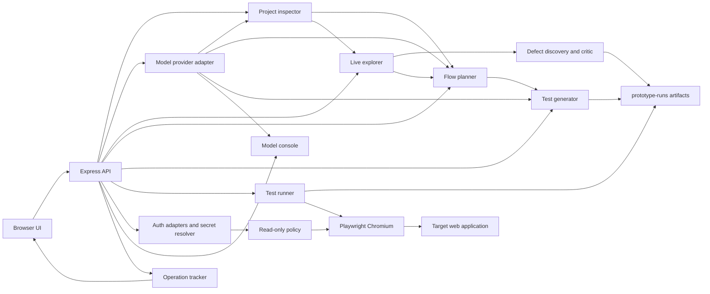

# Action E2E Prototype: System Specification

## 1. Purpose and Audience

This document explains how Action E2E Prototype works from project selection to result analysis. It is intended for:

- users who want to evaluate a local web application;
- researchers studying AI-assisted acceptance-test generation;
- engineers who need to maintain or extend the prototype;
- contributors adding providers, inspection strategies, flow types, or test generators.

The prototype investigates a specific question: can repository evidence, a rendered user interface, human-reviewed acceptance criteria, and a language model be combined into a traceable pipeline that produces executable E2E tests?

The model is the primary experimental subject, but its output is not treated as authoritative. Static inspection supplies repository evidence, the selected model performs semantic interpretation and stateful action selection, live browser observations ground its assumptions, and a human approves intended flows before generation. Deterministic code enforces safety and can compile an action journey already chosen and executed by the model; it does not invent semantic QA output. A non-AI control is available only through an explicit maintainer flag and is never an automatic fallback.

## 2. Problem and Motivation

E2E tests are valuable because they exercise behavior close to what a user experiences. They are also expensive to design and maintain because their author needs to understand the application, identify important journeys, convert those journeys into acceptance criteria, choose stable selectors, arrange runtime dependencies, and interpret failures.

Large language models can accelerate parts of this work, but unrestricted test generation creates several risks:

- invented routes, controls, and requirements;
- selectors that do not match the rendered DOM;
- unsafe interactions such as deletion, authentication, checkout, uploads, or native dialogs;
- syntactically plausible tests that never navigate to the application;
- passing smoke tests that provide too little evidence to be audited;
- opaque decisions that prevent a reviewer from knowing what was inferred.

Action E2E Prototype addresses these risks by exposing a staged pipeline. Each stage produces an observable intermediate artifact and can continue partially when a later stage is blocked.

## 3. Scope

### 3.1 Current scope

- Local analysis of web-project directories.
- Static sites and command-started web applications.
- Applications already running at an external URL.
- Automated runtime suggestions for common JavaScript web projects.
- Required local or hosted text-model participation in semantic stages.
- Human review of candidate flows and Given/When/Then criteria.
- Playwright test generation and execution.
- Screenshots, videos, traces, JSON reports, logs, and summarized insights.
- Guest and authenticated read-only exploration and execution.
- Environment-backed authentication references, trusted adapters, mutation blocking, artifact quarantine, and secret scanning.
- English-language interface, prompts, artifacts, and documentation.
- Live progress, elapsed time, and milestone feedback for long-running pipeline operations.
- Blind guest UI-defect discovery with persisted viewport evidence, observed-versus-inferred claims, and conservative model review.

### 3.2 Out of scope for the current prototype

- Native mobile test execution.
- Credential creation, recovery, rotation, or display.
- Automatic completion of CAPTCHA, interactive MFA, payment, destructive operations, or privileged actions.
- Multi-user tenancy or a hosted shared secret vault.
- Full repository indexing beyond the configured scan limits.
- Multimodal review of authenticated pages.
- Guaranteed domain-level correctness of generated acceptance criteria.

## 4. Design Principles

1. **Evidence before generation.** Static source evidence and live DOM observations should precede model-authored test code.
2. **Human approval before execution artifacts.** The user can edit, approve, or reject proposed flows and criteria.
3. **AI-first fail-fast behavior.** If a required model stage is unavailable, malformed, unsafe, or ungrounded, the pipeline stops at that stage.
4. **No semantic fallback.** Partial objective evidence is retained, but prewritten flows or tests do not replace failed model work.
5. **Target-project preservation.** Generated artifacts live under the prototype's `prototype-runs/` directory rather than in the inspected repository.
6. **Auditability.** Passing and failing tests retain visual evidence.
7. **Local-first operation.** The prototype can use a local model without sending repository summaries to a hosted provider.
8. **Explicit execution authority.** Runtime settings remain visible and editable; dependency installation is opt-in.
9. **Secrets stay outside generated intelligence.** Authentication values are resolved by trusted server code and never enter prompts, action plans, generated tests, reports, or browser state files.
10. **Read-only is enforced below the model.** Authenticated action schemas and network interception remain authoritative even if inferred criteria are unsafe.
11. **No silent waiting.** Long-running work reports curated server-side phases so the evaluator can distinguish progress from a stalled interface.

## 5. Technology Choices

### 5.1 JavaScript and Node.js

The prototype uses JavaScript on Node.js because the target domain is browser automation and web-project inspection. A single language can serve the UI, API, filesystem analysis, process orchestration, provider adapters, and generated Playwright tests.

This choice reduces prototype overhead in several ways:

- Playwright has first-class Node.js support.
- `package.json` manifests can be parsed without a language bridge.
- Node provides direct filesystem, process, HTTP, and child-process APIs.
- Generated tests can use the same module ecosystem as the prototype.
- Users evaluating JavaScript/TypeScript projects are likely to have a compatible runtime already.

The code uses CommonJS because the implementation is small, local, and does not require a compilation or bundling stage. This keeps `npm start` sufficient to launch the application.

### 5.2 Express

Express provides the local HTTP server, JSON API, static-asset delivery, artifact delivery, and centralized error handling. It was selected over a larger full-stack framework because the prototype benefits from a transparent request/response boundary and minimal build configuration.

The UI calls explicit API endpoints for each pipeline transition. This makes stage inputs and outputs easier to inspect, test, and replace than tightly coupling the pipeline to a server-rendered framework.

### 5.3 Vanilla HTML, CSS, and browser JavaScript

The frontend is intentionally implemented without React, Vue, or another client framework. The UI has one workspace and a finite state machine, so direct DOM rendering keeps the dependency surface small and avoids a frontend build chain. The tradeoff is that `public/app.js` owns manual state and rendering functions; a component framework may become justified if the UI grows substantially.

### 5.4 Playwright

Playwright is the execution engine because it supports modern browsers, semantic locators, automatic waiting, trace recording, screenshots, video, and machine-readable reports. Those capabilities directly support the project's requirement that users visually attest generated tests rather than trusting only a pass/fail count.

### 5.5 Cheerio

Cheerio supports lightweight static HTML parsing during repository inspection. Static inspection does not replace browser exploration; it provides early UI hints before the application is running.

## 6. High-Level Architecture



The UI is a pipeline coordinator, not the execution engine. The Express API validates each request and delegates work to focused services. Services communicate through plain objects that can be serialized into run artifacts.

## 7. Repository Structure

| Path | Responsibility |
| --- | --- |
| `src/server.js` | Express application, API routes, dependency orchestration, and error responses. |
| `src/services/project-inspector.js` | Repository scan, manifest ranking, framework/language detection, static UI hints, and runtime recommendation. |
| `src/services/runtime-orchestrator.js` | Runtime normalization, optional installation, static server, command startup, external URL checks, and process cleanup. |
| `src/services/live-explorer.js` | Headless browser exploration and extraction of rendered routes, controls, labels, and visible text. |
| `src/services/agentic-explorer.js` | Bounded model-guided state exploration, action validation, state fingerprints, safety classification, and coverage metrics. |
| `src/services/bug-discovery.js` | Blind UI-defect hypotheses, fact/reference validation, transition context, conservative model review, and report assembly. |
| `src/services/flow-planner.js` | Explicit non-AI experimental control and authenticated-flow support; it is not used for ordinary guest semantic planning. |
| `src/services/ai-workflows.js` | Model-assisted inspection, flow/criteria refinement, and result-insight enrichment. |
| `src/services/llm-provider.js` | Provider catalog, configuration normalization, model discovery, text and base64 image transport, Ollama calls, and OpenAI-compatible calls. |
| `src/services/bug-evaluator.js` | Historical-pair classification, blind-defect matching, trajectory/oracle compilation, and benchmark plan validation. |
| `src/services/test-generator.js` | Run creation, model test drafting, grounding guardrails, model-journey compilation, and Playwright spec rendering. |
| `src/services/test-runner.js` | Playwright CLI execution, report parsing, evidence normalization, and visual-evidence indexing. |
| `src/services/auth-config.js` | Access normalization, `E2P_AUTH_*` reference validation, environment-backed resolution, public metadata, redaction, and child-process isolation. |
| `src/services/auth-session.js` | Trusted Janvas token, session-cookie, form-login, and HTTP Basic browser-session adapters. |
| `src/services/read-only-policy.js` | Authenticated action schema and browser-network restrictions. |
| `src/services/authenticated-executor.js` | Trusted action execution, session verification, screenshots, policy reporting, and secret-scan gate. |
| `src/services/insight-builder.js` | Objective result measurements supplied to model-based result interpretation. |
| `src/services/ai-console.js` | Conversational model access with a compact summary of current pipeline state. |
| `src/services/operation-tracker.js` | Temporary operation state, monotonic progress, bounded milestone history, completion, and failure reporting. |
| `src/services/artifact-store.js` | Run-directory creation, JSON/text persistence, authenticated artifact quarantine, scanning, and removal of secret-bearing files. |
| `src/services/directory-picker.js` | Native Windows directory-selection integration. |
| `public/index.html` | Interface structure and pipeline controls. |
| `public/app.js` | Client state, API calls, validation, editing, and result/evidence rendering. |
| `public/styles.css` | Responsive visual system. |
| `test/services.test.cjs` | Unit-level regression checks for providers, evidence, generation guardrails, runtime inference, auth references, isolation, and constrained plans. |
| `test/authentication.integration.test.cjs` | Real Chromium integration tests for authenticated mutation blocking and guest-pipeline regression. |

## 8. End-to-End Pipeline

### 8.0 Cross-cutting operation feedback

Every potentially long UI action creates a random operation identifier and includes it in the corresponding API request. The server registers an in-memory operation and the responsible services publish curated milestones at actual boundaries: repository indexing, manifest analysis, target startup, browser launch, route observation, model refinement, per-flow artifact validation, Playwright execution, evidence indexing, and insight consolidation.

While the request remains active, the browser polls `GET /api/operations/:operationId` approximately twice per second. Only the sticky activity monitor is updated, avoiding full-page rendering during background work. Guest exploration additionally publishes the latest compact JPEG, action, rationale, expected result, route, headings, and controls. Historical events omit image bytes, preventing memory growth. The viewer expands while exploration runs, collapses afterward, and can be reopened for review. Authenticated exploration never publishes a screenshot or visible text preview.

The main workspace contains no explanatory pipeline strip, badges, or model-participation cards. This material is consolidated in the `About the workflow` modal, which uses a native accessible dialog and supports Escape and backdrop dismissal.

Operation messages are authored by E2P rather than copied from child-process stdout or model responses. Records are memory-only, expire after thirty minutes, and are capped to prevent unbounded growth. They do not contain authentication values, environment references, API keys, cookies, or raw target logs. Older clients remain compatible because `operationId` is optional at the API boundary.

### 8.1 Step 0: Provider configuration

The user selects a model provider before loading a project. Local Ollama is the initial provider and `qwen3:8b` is preferred when available. The supported adapters are:

- local Ollama;
- local LM Studio;
- OpenRouter;
- Groq;
- Together AI;
- Hugging Face Inference Providers;
- any custom OpenAI-compatible chat-completions endpoint.

Ollama is queried through `/api/tags`; LM Studio model discovery uses the OpenAI-compatible `/models` endpoint. Hosted providers require a model identifier and, when applicable, an API key. API keys are held in browser memory and sent with requests; the prototype does not persist them.

The provider adapter can transport up to four base64-encoded images, capped at 16 MB each, to Ollama vision models or OpenAI-compatible multimodal endpoints. Local file paths are never sent. This capability is currently used by the controlled historical bug-discovery scripts; the normal UI exploration pipeline still supplies text and structured browser observations only.

If no configured model is available, loading stops before semantic inspection. A timeout, malformed response, unsafe action, or ungrounded output also stops the affected stage. Objective evidence collected before the failure remains available for diagnosis. Maintainers may expose a non-AI experimental control with `E2P_ENABLE_BASELINE_MODE=1`; ordinary users do not see it.

### 8.2 Step 1: Project selection

The user chooses a directory with the Windows picker or enters a path manually. `POST /api/project/select` invokes the native picker. `POST /api/project/load` validates that the path exists and is a directory.

The selected directory is treated as the target-project root. The prototype does not clone repositories and does not require the target to be a Git repository.

### 8.3 Step 2A: Static project inspection

`project-inspector.js` traverses up to four directory levels and stops after 600 files. It excludes dependency, build, editor, cache, Git, virtual-environment, and prior artifact directories.

The inspector gathers:

- file-extension counts;
- README excerpts;
- all reachable `package.json` manifests;
- framework and language signals;
- relevant source excerpts;
- headings, links, buttons, forms, inputs, status elements, and canvases visible in static HTML-like source;
- warnings and a confidence level.

When several manifests exist, candidates are scored. Web frameworks, frontend dependencies, startup scripts, and paths such as `apps/web/` increase priority; mobile/native paths reduce it. This allows a web application inside a monorepo to become the primary analysis target.

### 8.4 Step 2B: Runtime recommendation

The runtime recommendation is evidence-derived. The prototype detects lockfiles or a declared package manager, startup scripts, framework defaults, explicit ports, README commands, and the selected manifest's working directory.

The four runtime modes are:

| Mode | Behavior |
| --- | --- |
| `static` | Serve the selected directory through an internal Express server on an available port. |
| `command` | Start the detected or user-confirmed command inside the selected working directory and wait for the base URL. |
| `external` | Do not start a process; wait for the user-provided URL to respond. |
| `manual` | Preserve inspection and planning, but do not attempt live execution. |

The UI automatically populates install command, start command, base URL, and working directory. These remain editable. Installation runs only when the user selects the installation checkbox. The working directory is resolved against the target root and rejected if it attempts to escape that root.

Vinext is detected separately from conventional Next.js and defaults to `localhost`, matching its Vite-based development server. During command startup, E2P parses loopback URLs announced in stdout/stderr and probes equivalent `localhost`, `127.0.0.1`, and `::1` addresses. The reachable URL becomes the effective Playwright base URL. A process that exits before readiness fails immediately with sanitized output, and every unsuccessful startup terminates its process tree.

The model may explain the project and its runtime context, but shell commands are derived from project evidence instead of unrestricted model output.

### 8.5 Step 2C: Required semantic inspection

`enhanceInspectionWithAi` sends a compact project summary to the configured model. The prompt asks for a synopsis, expected user persona, capabilities, confidence, reasoning, and warnings in JSON.

The response is sanitized and merged with repository evidence. If it times out, is malformed, or fails after one structured-response correction attempt, project loading stops with an explicit error.

### 8.6 Step 2D: Live interface exploration

Live exploration is mandatory before flow planning and test generation. The runtime orchestrator serves or starts the target and waits up to the configured timeout for the URL to respond. Playwright launches Chromium and observes the rendered page.

The explorer records visible headings, buttons, links, inputs, labels, placeholders, overlays, forms, canvas count, URL, and route path. Every visible control receives a temporary action identifier inside the isolated browser context. Accessible names include ARIA labels, visible text, titles, placeholders, and image alternative text.

E2P sends only the current evidence and allowed action identifiers. The model chooses an `actionId` or finishes; the executor derives `click`, `fill`, `select`, or `press` from that catalog entry. The grounded identifier is authoritative, so an unsupported or conflicting verb cannot invalidate or alter an otherwise valid selection. Unknown IDs, missing IDs, missing required values, or invalid select options receive one correction request to the same model; a second invalid response stops exploration. The model cannot return selectors, scripts, routes, or shell commands. Sensitive inputs, external navigation, checkout, payment, deletion, upload, publishing, and final submission remain blocked below the model.

After every successful action, E2P captures a new state fingerprint, visible overlay evidence, changed-state status, rationale, expected outcome, and guest preview. The active budget is recalculated from unique safe controls and newly discovered states. Simple interfaces therefore receive a small budget, while interfaces that reveal additional behavior receive more decisions and time. Twenty actions and 180 seconds are hard safety ceilings rather than fixed targets. Voluntary completion requires at most two initial useful actions and scales down when the interface exposes fewer opportunities; safe-action exhaustion can end the run earlier. An unrepaired invalid decision, unsafe request, execution failure, or linked runtime error stops exploration and preserves the partial trace.

The target process is stopped after exploration. The observations are merged back into the inspection, and model-based semantic inspection may run again with live evidence. Live evidence is considered stronger than static inference.

#### 8.6.1 Potential-defect discovery

Guest exploration creates its run workspace before the target starts. Each distinct state keeps up to four viewport screenshots for human inspection. A vision-capable model served locally receives only one focal screenshot per request, while immediate before/after states and the executed transition are supplied as compact structured evidence. Models without image support receive the same state graph without image bytes.

The bug-hunter role may propose at most two hypotheses per focal state. Each candidate must contain a title, affected flow, preconditions, reproduction steps, observed result, cited facts, expected result, expectation justification/source, severity, confidence, and state IDs. A candidate is rejected before review when it describes normal behavior, cites an unknown state, lacks a reproduction path, or claims an anomaly that does not appear in any cited fact.

A second model call acts as a conservative reviewer. It attempts to falsify each surviving candidate by checking whether the observed behavior already satisfies the expectation, whether visible feedback contradicts the claim, whether the stated action occurred, and whether the state is simply an ordinary empty or boundary condition. Unreviewed candidates are not retained. Rejected titles and reasons remain visible because false positives are an evaluation result.

The reviewer may use a separately selected model. Its output records four gates: `actionExecuted`, `expectationGrounded`, `evidenceSufficient`, and `expectationSatisfied`. E2P derives retention only when the first three are true and the expectation is false. Author and reviewer confidence are preserved independently; neither is treated as calibrated correctness.

For creation-like text fields that declare no minimum length, the action catalog may request a general one-character boundary probe. Safe guest input values are captured separately from rendered text so a value remaining in a field cannot be mistaken for a created item. When a completed action leaves the structured state unchanged despite a recorded expected outcome, E2P adds that transition as an objective fact. A compiled journey can use the expected created text as a Playwright oracle, enabling historical red/green validation.

Retained items remain `hypothesis`, carry `requiresHumanValidation: true`, and visually separate `observed` facts from the inferred `expected` behavior. Browser console and page errors may be cited. The current experiment does not collect request or response records.

### 8.7 Step 3: Access mode and authenticated session preparation

The evaluator chooses `Guest` or `Authenticated / read-only` after inspection. The browser UI accepts profile metadata and environment-variable names only. Every authentication reference must begin with `E2P_AUTH_`; values are resolved exclusively in the server process when exploration or execution starts.

The implemented adapters are:

| Adapter | Secret references | Preparation |
| --- | --- | --- |
| `janvas-canvas-token` | One token | Adds `canvasApiKey` and `canvasApiBase` HttpOnly cookies to an isolated context without using the visible onboarding form. |
| `cookie-session` | One session value | Adds a user-named HttpOnly cookie for a single target origin. |
| `form-login` | Username and password | Uses confirmed selectors while evidence is disabled and permits non-GET traffic only to confirmed authentication paths. |
| `http-basic` | Username and password | Supplies credentials through trusted Playwright context options. |

Every profile also defines an initial path, read-only path allowlist, optional success path/text, and adapter-specific non-secret settings. `POST /api/auth/status` reports only whether required fields are configured. The response never contains a credential or environment reference.

Live authenticated exploration installs the network policy before opening a page. It blocks external origins, non-read methods outside approved authentication endpoints, non-allowlisted document paths, and routes with unsafe mutation semantics. The explorer visits only concrete allowlisted routes and returns sanitized access metadata and policy events.

### 8.8 Steps 4 and 5: Flows and acceptance criteria

In normal guest runs, the planner starts from no prewritten candidate flows. After live exploration, static summaries and README interpretation are removed from the planning context; the model receives only the current project identity, executed state graph, action labels, and rendered evidence.

Authenticated mode replaces these broad interaction candidates with `authenticated-read-only` flows grounded in verified protected routes. Each authenticated flow records prohibited effects and is limited to navigation and observation criteria.

Each flow contains an ID, title, summary, confidence, source signals, assumptions, Given/When/Then criteria, and a test blueprint. Destructive or risky actions are filtered.

The model may author up to four semantic flows, but every title and criterion must share meaningful domain vocabulary with its cited state. Generic words such as `view`, `display`, and `navigate` do not establish grounding. The terminal state must also be causally compatible with its entering action. Flow count is a coverage target, not an arbitrary validity quota: one genuinely grounded flow is admissible even when other proposals are rejected. If a broad multi-flow response is insufficient, E2P decomposes planning into one model request per observed transition and fixes only the factual resulting state ID; the model still authors intent and criteria. Planning stops only when no admissible model-authored flow remains.

The UI presents every flow with:

- an approval checkbox;
- confidence and source information;
- editable acceptance-criteria text.

Only approved flows are sent to test generation. This is the explicit human-in-the-loop gate.

### 8.9 Step 6: Test generation

Every generation request creates a unique run under `prototype-runs/<project>-<timestamp>/`. The run stores the inspection, approved flows, normalized runtime configuration, generated-test metadata, Playwright configuration, and tests.

Generation requires completed, error-free model-guided exploration. The model first attempts to author a grounded Playwright body for each human-approved flow.

Model-generated code is validated before it is saved. Current guardrails reject:

- a complete nested `test(...)` declaration instead of a body;
- Cypress, Selenium, WebDriver, or invented assertion APIs;
- absolute `page.goto()` calls;
- raw text-engine selectors;
- missing Playwright assertions or navigation;
- page interaction before `openHome(page)`;
- duplicate home navigation, missing `await` on browser actions, or URL assertions for paths that were not observed;
- generic unscoped roles such as `getByRole('button')`;
- labels or placeholders not found in observed evidence;
- risky clicks or interactions not supported by known controls.

If free-form validation fails but the approved flow cites a successfully executed model journey, E2P compiles that exact action sequence into constrained Playwright. The compiler includes all prerequisite model actions, uses observed accessible names and stable DOM evidence, makes repeated accessible-name occurrences explicit, preserves the read-only execution boundary, and asserts the resulting state. This is recorded as `model-journey-compiled`: the semantic journey still came from the model, while trusted code renders it safely. If no traceable journey exists, generation stops.

Authenticated generation uses a separate contract. The model may propose JSON actions only from `navigate`, `assert-body`, `assert-heading`, `assert-text`, `assert-url`, and `capture`. `read-only-policy.js` validates every action and route. Invalid or unavailable model output stops generation. The resulting `*.actions.json` files contain no arbitrary JavaScript, credential value, cookie, header, or secret reference.

### 8.10 Step 7: Test execution

The execution endpoint requires a generated run. It optionally installs target dependencies, starts the configured runtime, and launches the Playwright CLI with `TARGET_BASE_URL` in the environment.

The generated Playwright configuration uses Chromium-compatible execution settings and retains:

- JSON reporter output;
- screenshots;
- videos;
- traces;
- test stdout and stderr.

Runtime cleanup occurs in a `finally` path. On Windows, command-started process trees are terminated after the run.

Authenticated plans do not use the Playwright CLI child process. `authenticated-executor.js` launches Chromium directly, asks the trusted adapter for an ephemeral context, validates the saved plans again, and executes only supported read-only actions. It records a sanitized report and post-authentication screenshots. Before each capture, it checks the page URL, visible text, and visible non-password form values for every active credential; a match suppresses the screenshot and fails the flow safely. Trace, video, network payload logging, raw browser output, and `storageState` persistence remain disabled.

Before execution, the run receives a `.quarantine` marker and `/artifacts` returns HTTP 423 for that run. Every file is scanned byte-for-byte against the active secret values. A match causes affected files to be removed and leaves the run quarantined. A successful scan writes only status and scanned-file count, removes the marker, and allows artifact delivery.

Guest Playwright subprocesses now receive an allowlisted operating-system environment rather than inheriting all E2P variables. Target application processes inherit normal runtime variables but all `E2P_AUTH_*` entries are removed.

### 8.11 Step 8: Results and insights

The test runner recursively parses Playwright suites and normalizes test status, duration, errors, and attachments. Evidence paths are converted to safe paths relative to the run directory.

The UI displays:

- total, passed, failed, and skipped counts;
- the base URL used;
- per-test status and error information;
- a gallery of screenshots, videos, and trace links;
- objective execution measurements and model-generated semantic insights;
- limitations and recommended next steps.

Passing tests retain the same evidence categories as failing tests. A green result therefore remains visually reviewable.

Authenticated results additionally display adapter, session-verification status, blocked-request count, evidence restrictions, and secret-scan status. Their gallery intentionally contains screenshots only.

### 8.12 Cross-cutting model console

The conversational console sends the selected model a compact summary of the current project, inspection, plan, execution, and insights. It supports questions about the current pipeline state. It is advisory and does not execute shell commands or mutate the target project.

## 9. API Surface

| Method and path | Purpose | Principal input | Principal output |
| --- | --- | --- | --- |
| `GET /api/health` | Server availability and loopback request token | None | Health, timestamp, and ephemeral request token |
| `GET /api/operations/:operationId` | Poll live progress for one local pipeline operation | Random operation identifier | Sanitized phase, progress, elapsed timestamps, status, and bounded milestones |
| `POST /api/auth/status` | Validate secret-reference availability without returning values | Auth profile metadata | Configured/missing status and public metadata |
| `GET /api/ai/status` | Provider and local-model discovery | None | Provider catalog |
| `POST /api/project/select` | Native folder picker | None | Selected path |
| `POST /api/project/load` | Static and semantic inspection | Project path, AI config | Inspection |
| `POST /api/project/explore-live` | Runtime startup and guest/authenticated browser observation | Path, inspection, runtime, AI config, auth metadata | Live and merged inspection |
| `POST /api/pipeline/plan` | Guest or authenticated read-only flow proposal | Inspection, AI config, auth metadata | Plan |
| `POST /api/tests/generate` | Isolated spec or constrained-action generation | Inspection, approved flows, runtime, AI config, auth metadata | Generated run metadata |
| `POST /api/tests/run` | Guest CLI or trusted authenticated execution | Generated run and pipeline context | Execution, policy, evidence, and insights |
| `POST /api/ai/chat` | Contextual model conversation | Conversation and pipeline state | Model reply |

## 10. Run Artifact Contract

A typical run contains:

```text
prototype-runs/<run-id>/
  exploration.json
  inspection.json
  approved-flows.json
  runtime-config.json
  generated-tests.json
  playwright.config.cjs
  README.md
  tests/
    <flow-id>.spec.cjs
  results/
    potential-bugs.json
    blind-evaluation.json
    playwright-results.json
    visual-evidence.json
    insights.json
    stdout.log
    stderr.log
    test-artifacts/
      <test-name>/
        test-finished-1.png
        video.webm
        trace.zip
```

Run directories are generated data and are excluded from Git. A report should refer to run IDs when reproducibility matters.

An authenticated run replaces `playwright.config.cjs` and `*.spec.cjs` with:

```text
  auth-metadata.json
  tests/
    <flow-id>.actions.json
  results/
    auth-execution.json
    test-artifacts/
      <flow-id>-authenticated-read-only.png
```

Neither layout stores credential values or environment references.

## 11. Failure and Interruption Semantics

| Failure | Pipeline behavior |
| --- | --- |
| Missing/invalid project directory | Loading stops with an explicit error. |
| Folder picker blocked | Manual path entry remains available. |
| No model selected | The requested semantic stage stops and asks for a configured provider. |
| Model timeout or malformed JSON | One structured correction may be attempted; if it still fails, the stage stops. |
| Runtime cannot be inferred | Inspection and planning continue in `manual` mode. |
| Runtime does not answer | Live exploration reports failure; static artifacts remain available. |
| No completed model-guided live evidence | Flow planning and generation stop. |
| Unsafe/ungrounded model code | The body is rejected; an exact executed model journey may be compiled, otherwise generation stops. |
| Guest Playwright test failure | Failure, logs, screenshot, video, trace, and error details are retained. |
| Authenticated action failure | Sanitized error and a safe post-authentication screenshot are retained; trace and video stay disabled. |
| Insight model failure | Objective execution evidence remains, but semantic consolidation stops and reports the model failure. |
| Missing authentication reference | Static analysis and planning remain available; live exploration and execution stop with a sanitized configuration error. |
| Invalid or expired authenticated session | The context closes, no reusable state is written, and the run reports authentication failure. |
| Authenticated mutation attempt | The browser policy aborts the request and records method, normalized path, decision, and rule only. |
| Credential reflected by the rendered page | Screenshot capture is suppressed, the flow receives a sanitized failure, and no image is written. |
| Secret detected in an artifact | The matching file is removed and the run remains quarantined. |

## 12. Security, Privacy, and Trust Boundaries

- The selected target path and runtime commands are trusted user inputs.
- Hosted providers receive the compact context sent by AI workflows; users should use local providers for sensitive repositories.
- API keys are not written into run artifacts by the current implementation.
- Authentication values must come from `E2P_AUTH_*` environment references or an external secret facility that injects those variables before E2P starts.
- The UI, model, generated plans, generated code, and run metadata never receive authentication values.
- Authenticated contexts are isolated per exploration/run and closed in `finally`; no `storageState` file is created.
- Authenticated network policy is default-deny for mutations and external origins.
- Sensitive loopback endpoints require an ephemeral request token obtained by the same-origin UI.
- Authenticated artifacts are quarantined until secret scanning succeeds.
- Authenticated visual evidence is checked for credential reflection before image creation.
- Install commands are not run by default.
- The target working directory cannot resolve outside the selected root.
- Risky UI actions are filtered, but this is a prototype safeguard rather than a formal sandbox.
- Command mode executes a local project script with the user's operating-system permissions. Users should inspect unknown repositories before starting them.
- Generated tests are isolated from the target repository, but the target application itself may mutate its own external services if its startup configuration allows that.

## 13. Running and Verifying the Prototype

Prerequisites:

- Node.js and npm;
- a Chromium installation managed by Playwright;
- optional Ollama, LM Studio, or hosted-provider credentials;
- the package manager required by the target project when command mode is used.

```powershell
npm.cmd install
npx.cmd playwright install chromium
npm.cmd start
```

Open `http://127.0.0.1:4318`.

For authenticated execution, inject the required value into an `E2P_AUTH_*` environment variable before starting E2P. The UI receives only that variable's name. Select an adapter, allowlist the smallest possible set of read-only paths, check configuration status, and run authenticated live exploration before generating criteria.

Run internal regression tests with:

```powershell
npm.cmd test
```

Run only the real-browser guest/authenticated integration layer with:

```powershell
npm.cmd run test:smoke
```

The `.cmd` executables avoid the common Windows PowerShell restriction that blocks `npm.ps1` when script execution is disabled.

## 14. Extension Guide

### 14.1 Add an AI provider

1. Add a provider definition in `llm-provider.js`.
2. Decide whether it uses Ollama-specific or OpenAI-compatible transport.
3. Add local model discovery when the provider exposes a model-list endpoint.
4. Normalize endpoint, model, key requirements, and label.
5. Add provider tests without embedding real credentials.
6. Verify malformed responses, timeout behavior, and fail-fast errors.

### 14.2 Add a new application archetype or flow

1. Add static/live signals to the evidence collector if the behavior cannot currently be observed.
2. Extend the safe action vocabulary only when the browser executor can enforce it.
3. Extend model prompts and evidence-grounding validation together.
4. Add constrained rendering for the new observed action type in `test-generator.js`.
5. Test model acceptance, rejection, and fail-fast behavior.

### 14.3 Add a runtime strategy

1. Extend runtime recommendation and normalization.
2. Keep startup configuration visible to the user.
3. Validate paths and commands before execution.
4. Implement readiness detection and cleanup.
5. Preserve partial analysis when startup fails.

### 14.4 Replace the frontend architecture

A component framework may be introduced if state complexity, routing, or reusable widgets grow. Preserve the current API contracts and human approval gate. A migration should not hide generation mode, interruption reason, runtime authority, or visual evidence.

## 15. Testing Strategy

The internal test suite currently covers:

- local and hosted provider normalization;
- Playwright result and evidence parsing;
- the live-evidence requirement for model-authored tests;
- rejection of generic role selectors and invalid generated structures;
- label/placeholder grounding;
- runtime inference for a nested web manifest.
- Vinext detection, localhost/IPv4/IPv6 fallback, announced development URLs, early-exit diagnostics, and failed-start cleanup;
- preservation of observed accessible names for exact role-based locators;
- Firefox-oriented compositing safeguards and explicit opt-in for model inference;
- live detection of Vite/Webpack development overlays and mandatory overlay absence in generated guest specs;
- secret-reference validation, resolution, disposal, and redaction;
- target and Playwright child-process environment isolation;
- constrained authenticated action validation and route allowlists;
- authenticated flow planning;
- real Chromium authentication through a temporary protected application;
- blocking a browser-originated mutation before it reaches the temporary server;
- secret scanning and authenticated screenshot evidence;
- pre-capture suppression when a target renders a canary credential;
- generated run/result path containment;
- a complete guest generation/execution regression run.

Recommended future layers are:

- API integration tests for every malformed authentication adapter configuration;
- fixture repositories for each framework and runtime mode;
- model-contract tests with recorded provider responses;
- adversarial tests for unsafe interactions and prompt injection in repository text;
- repeatability measurements across model/provider combinations;
- UI tests for human editing, approval, evidence rendering, and recovery from errors.

## 16. Known Limitations and Planned Evolution

- Repository reading is bounded by depth and file-count limits and does not perform semantic code indexing.
- Runtime inference focuses on common JavaScript web conventions.
- Stateful exploration is bounded and may stop early when a model repeats unchanged actions, returns invalid identifiers, or finishes voluntarily.
- Guest live exploration can send one current viewport to a locally served vision model and stores additional tiles for human review. Flow planning and test generation remain grounded in structured browser states.
- The deterministic flow library is an explicit, hidden experimental control only; it is disabled in the normal product path and is never counted as model success.
- Acceptance-criteria quality still requires human judgment.
- Provider latency, cost, context limits, and structured-output reliability vary.
- There is no persistent experiment database; run artifacts are filesystem-based.
- Quantitative model comparison is currently file-based through `scripts/evaluate-models.cjs`, `MODEL_EVALUATION_REPORT.md`, and `evaluation-results/`; it is not yet an interactive dashboard.
- Interactive MFA and CAPTCHA are not automated. A previously established session may be supplied through the session-cookie adapter.
- The read-only route policy cannot prove that a poorly designed `GET` endpoint is side-effect free; unsafe path semantics and explicit allowlists reduce but do not eliminate that target-design risk.
- Authenticated screenshots can contain private application content even when active credentials are absent. The pre-capture guard covers URL, visible text, and visible non-protected form values, but evidence retention remains the evaluator's responsibility.
- Playwright traces and videos remain disabled for authenticated runs until their credential-redaction properties can be proven.

The next architectural milestone should repeat the controlled protocol across more projects and random seeds, then add reviewer-scored flow relevance, criteria completeness, false-positive rate, latency, cost, and reviewer effort.

## 17. Related Documentation

- `README.md`: installation and practical overview.
- `STATUS_REPORT.md`: implementation and initial validation status.
- `OLLAMA_TOY_EXAMPLES_REPORT.md`: concrete local-model experiments with Janvas and MDN.
- `MODEL_EVALUATION_REPORT.md`: controlled local-model comparison and Dopa execution evidence.
- `EXTERNAL_BLIND_EVALUATION_REPORT.md`: complete third-party application run, false-positive review, and reproducibility data.
- `specs.bdd.md`: user and engineering flows expressed as behavioral scenarios.
